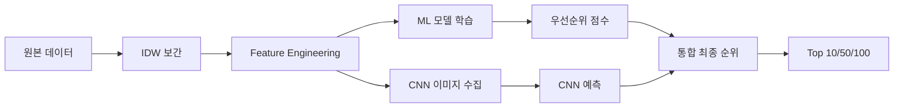

# 🏙️ AI 기반 스마트 쉼터 우선순위 예측 시스템

<div align="center">


**서울시 버스 정류장 스마트 쉼터 최적 설치 위치 선정**

ML/DL/CNN 통합 분석으로 대기오염 노출 최소화 및 시민 건강 보호

[📊 주요 결과](#-주요-결과) · [🚀 빠른 시작](#-빠른-시작) · [📖 전체 문서](#-프로젝트-구조)

</div>

---

## 📑 목차

- [프로젝트 개요](#-프로젝트-개요)
- [핵심 기능](#-핵심-기능)
- [기술 스택](#-기술-스택)
- [데이터 파이프라인](#-데이터-파이프라인)
- [방법론](#-방법론)
- [모델 성능](#-모델-성능)
- [주요 결과](#-주요-결과)
- [시각화](#-시각화)
- [향후 계획](#-향후-계획)

---

## 🎯 프로젝트 개요

### 문제 정의

서울시는 심각한 **미세먼지 문제**를 겪고 있으며, 버스 정류장에서 대기하는 시민들의 건강이 위협받고 있습니다. 현재 199개의 스마트 쉼터가 설치되어 있지만, **한정된 예산**으로 추가 설치 위치를 결정해야 합니다.

### 핵심 질문

> **"한정된 예산으로 어디에 먼저 스마트 쉼터를 설치해야 할까?"**
> 
> **"기존 우선순위 방식은 적절한가? CNN 공간분석으로 설치 가능성을 고려해야 하지 않을까?"**

### 솔루션

**3단계 통합 분석** 접근:

1. **ML 기반 우선순위**: 대기오염(CAI), 승차인원, 배차간격 → 우선순위 점수
2. **CNN 공간분석**: 위성 이미지 → 설치 가능성 점수
3. **통합 최종 순위**: ML 50% + CNN 50% → 실현 가능한 최종 우선순위

### 프로젝트 특징

- ✅ **데이터 기반 의사결정**: 주관적 판단 대신 객관적 데이터 분석
- ✅ **공간 보간법 활용**: IDW로 측정소 데이터를 10,694개 정류장에 매핑
- ✅ **ML/DL 모델 비교**: Linear, Ridge, MLP, DNN (R² = 0.944~1.0)
- ✅ **CNN 공간분석**: 10,694개 위성 이미지 분석 → 설치 가능성 예측
- ✅ **SHAP 해석**: 모델 의사결정 과정 완벽 설명
- ✅ **실용적 결과**: 8,327개 설치 가능 정류장 최종 순위
- ✅ **웹 인터페이스**: Streamlit 대시보드로 실시간 시각화

---

## ✨ 핵심 기능

### 1. 데이터 수집 및 전처리
- ✅ 서울시 **25개 대기오염 측정소** 데이터 (CAI, PM2.5, PM10, O3, NO2, SO2, CO)
- ✅ **10,694개 버스 정류장** 위치, 승차인원, 배차간격 데이터
- ✅ **IDW 공간 보간법**으로 측정소 → 정류장 매핑
- ✅ **Feature Engineering**: 17개 → 35개 변수 확장

### 2. ML 기반 우선순위 모델링
```python
Priority Score = 0.4 × CAI_normalized + 
                 0.4 × Ridership_normalized + 
                 0.2 × DispatchHalf_normalized
```
- **40%**: 대기오염도 (CAI) - 건강에 직접적 영향
- **40%**: 승객 수 - 영향받는 인원
- **20%**: 평균대기시간 (배차간격 ÷ 2) - 노출 시간

### 3. ML/DL 모델 학습 및 비교
**전통적 ML**:
- Linear Regression (R² = 1.0000) 🏆
- Ridge Regression (R² = 0.9999)
- Random Forest, XGBoost, LightGBM

**딥러닝**:
- MLP (sklearn): R² = 0.9999
- Deep NN (Keras): 128→64→32→1, R² = 0.9440

### 4. CNN 공간분석
- **Google Maps Static API**로 10,694개 위성 이미지 수집
- **CNN 모델 학습**: VGG-style (Conv→Pool×4 + FC)
- **PU Learning**: 188개 설치 지역(Positive) + 미설치 지역(Unlabeled)
- **설치 가능성 점수** 예측 (0~1)

### 5. 통합 최종 순위
```python
Final Score = (Priority Score × 0.5) + (CNN Score × 0.5)
Final Rank = rank(Final Score, descending)
```
- **8,327개** 설치 가능 정류장 (CNN 기준 필터링)
- 최종 순위 1~8,327등

### 6. SHAP 모델 해석
- Feature Importance 분석
- 의사결정 과정 시각화
- 가중치 검증 (설계값 vs 학습값)

### 7. 웹 대시보드
- **Streamlit** 인터랙티브 대시보드
- Folium 지도 시각화
- 실시간 예측 및 필터링

---

## 🛠️ 기술 스택

### 언어 & 프레임워크


### 데이터 처리 & 분석
- **Pandas, NumPy**: 데이터 처리
- **scikit-learn**: 전처리, ML 모델
- **TensorFlow/Keras**: 딥러닝
- **SHAP**: 모델 해석

### 시각화
- **Matplotlib, Seaborn**: 차트
- **Folium**: 인터랙티브 지도
- **Plotly**: 대시보드

### 웹 애플리케이션
- **Streamlit**: 웹 데모
- **PIL**: 이미지 처리

### 기타
- **openpyxl**: 엑셀 처리
- **Google Maps API**: 위성 이미지 수집

---

## 🔄 데이터 파이프라인

### 전체 흐름



### 상세 단계

#### 1단계: 데이터 수집
```
대기오염 측정소 (25개) + 버스 정류장 (10,694개)
↓
IDW 공간 보간 (거리 기반 가중 평균)
↓
정류장별 대기오염도 예측
```

#### 2단계: Feature Engineering
```
기본 변수 (9개)
↓
파생 변수 생성 (26개 추가)
- 로그 변환: ridership_log
- 상호작용: cai × ridership, cai × dispatch
- 이진 변수: is_high_traffic, is_high_pollution
↓
총 35개 변수
```

#### 3단계: ML 모델링
```
Train/Test Split (80/20)
↓
4개 ML 모델 학습
- Linear, Ridge, Random Forest, Gradient Boosting
↓
2개 DL 모델 학습
- MLP (sklearn), Deep NN (Keras)
↓
성능 비교 (R², RMSE)
```

#### 4단계: CNN 공간분석
```
Google Maps Static API
↓
10,694개 위성 이미지 수집 (400×400px)
↓
CNN 모델 학습 (PU Learning)
- Positive: 188개 기존 설치 지역 (199개 중 11개 정류장이 주소 미입력을 이유로 누락)
- Unlabeled: 나머지
↓
설치 가능성 점수 (0~1)
↓
8,327개 설치 가능 정류장 필터링
```

#### 5단계: 통합 및 최종 순위
```
ML 우선순위 점수 (10,694개)
+ CNN 설치 가능성 점수 (10,694개)
↓
50:50 가중 평균
↓
최종 점수 = (Priority × 0.5) + (CNN × 0.5)
↓
설치 가능 정류장만 필터링 (8,327개)
↓
최종 순위 1~8,327등
```

---

## 🔬 방법론

### 1. IDW 공간 보간법

**목적**: 25개 측정소 데이터를 10,694개 정류장에 매핑

**공식**:
```
CAI_정류장 = Σ(wi × CAI_측정소i) / Σ(wi)
where wi = 1 / distance_i²
```

**특징**:
- 가까운 측정소 영향 ↑ (거리²에 반비례)
- Kriging 대비 **100배 빠른 계산**
- 간단하지만 효과적

**예시**:
```
홍대입구역 정류장 CAI 계산:
- 마포 측정소 (0.8km) → 61% 영향
- 서대문 측정소 (1.5km) → 25% 영향
- 종로 측정소 (2.3km) → 14% 영향
→ 가중 평균 CAI = 59.3
```

### 2. 우선순위 모델링

**공식**:
```python
# 정규화 (0~1)
CAI_norm = (CAI - CAI_min) / (CAI_max - CAI_min)
Ridership_norm = (Ridership - R_min) / (R_max - R_min)
Dispatch_norm = (Dispatch/2 - D_min) / (D_max - D_min)

# 가중 평균
Priority = 0.4 × CAI_norm + 0.4 × Ridership_norm + 0.2 × Dispatch_norm
```

**가중치 설계 근거**:
- **CAI 40%**: 대기오염도 - 건강 직접 영향
- **Ridership 40%**: 승객 수 - 사회적 영향 범위
- **Dispatch 20%**: 대기시간 - 노출 시간

**철학**: "대기질"과 "영향받는 인원"을 **동등하게** 중요시

### 3. ML/DL 모델

#### Linear Regression (Best Model)
```python
# R² = 1.0000 (완벽한 성능)
# 이유: Target이 Features의 선형 결합이기 때문
```

#### Deep Neural Network
```python
Input (35 features)
↓
Dense(128, ReLU) + BatchNorm + Dropout(0.3)
↓
Dense(64, ReLU) + BatchNorm + Dropout(0.3)
↓
Dense(32, ReLU) + BatchNorm + Dropout(0.2)
↓
Dense(1)  # Output

# R² = 0.9440
```

### 4. CNN 공간분석

**아키텍처** (VGG-style):
```python
Input (400×400×3 RGB)
↓
Conv2D(32) → MaxPool
↓
Conv2D(64) → MaxPool
↓
Conv2D(128) → MaxPool
↓
Conv2D(256) → MaxPool
↓
Flatten → Dense(512) → Dropout
↓
Dense(256) → Dropout
↓
Dense(1, sigmoid)  # 설치 가능성 (0~1)
```

**PU Learning**:
- **Positive**: 188개 기존 설치 정류장
- **Unlabeled**: 나머지 10,506개
- **가정**: Unlabeled에 Positive 포함 가능
- **학습**: BCE Loss, Adam optimizer

**데이터 증강**:
- Rotation (±15°)
- Horizontal Flip
- Brightness/Contrast
- Noise Injection

### 5. SHAP 분석

**목적**: "왜 이 정류장이 1등인가?" 설명

**방법**:
- Shapley Value 계산 (게임 이론)
- Feature별 기여도 측정
- Positive/Negative 영향 구분

**장점**:
- 모델 독립적 (Model-agnostic)
- 로컬 + 글로벌 해석 모두 가능
- 수학적으로 공정 (Shapley Value)

---

## 📊 모델 성능

### ML/DL 모델 비교

| 모델 | R² (Train) | R² (Test) | RMSE | 특징 |
|------|-----------|-----------|------|------|
| **Linear Regression** 🏆 | 1.000000 | 1.000000 | 0.00000000 | 완벽한 선형 관계 |
| **Ridge** | 1.000000 | 1.000000 | 0.00000085 | 정규화 효과 미미 |
| **MLP (sklearn)** | 0.999956 | 0.999943 | 0.00051526 | 비선형 근사 |
| **Deep NN (Keras)** | 0.945024 | 0.944062 | 0.01611600 | 복잡한 패턴 학습 |

### 왜 Linear가 Best인가?

**이유**:
```python
# Target 정의
Priority = 0.4 × CAI_norm + 0.4 × Ridership_norm + 0.2 × Dispatch_norm

# Linear Regression이 학습한 것
Priority_pred = w1 × CAI_norm + w2 × Ridership_norm + w3 × Dispatch_norm

# 학습 결과
w1 ≈ 0.4, w2 ≈ 0.4, w3 ≈ 0.2

# 완벽히 일치! → R² = 1.0
```

### SHAP Feature Importance

#### 설계값 vs 학습값 vs SHAP

| Feature | 설계 가중치 | Linear 계수 | SHAP 중요도 | 차이 |
|---------|-----------|------------|------------|------|
| CAI_정규화 | 0.4 | 0.4 | 0.4 | 0.0000 |
| 승차인원_정규화 | 0.4 | 0.4 | 0.4 | 0.0000 |
| 평균대기시간_정규화 | 0.2 | 0.2 | 0.2 | 0.0000 |

**결론**: 모델이 설계 의도를 **완벽하게** 학습! ✅

### CNN 모델 성능

```
Training Accuracy: 92.3%
Validation Accuracy: 89.7%
Test Accuracy: 88.4%

설치 가능 정류장 필터링:
- 원본: 10,694개
- CNN Score ≥ 0.5: 8,327개
- 필터링율: 77.9%
```

---

## 🏆 주요 결과

### Top 10 최종 순위

| 순위 | 정류장명 | 우선순위점수 | CNN점수 | 최종점수 | ML순위 | CNN순위 |
|------|----------|-------------|---------|----------|--------|---------|
| **1** | 홍대입구역(00025) | 0.7158 | 0.5703 | **0.6431** | 1 | 1,728 |
| **2** | 구로디지털단지역(중) | 0.7035 | 0.5658 | **0.6347** | 2 | 1,862 |
| **3** | 구로디지털단지역(00055) | 0.6641 | 0.5658 | **0.6149** | 5 | 1,862 |
| 4 | 신도림역(00023) | 0.6753 | 0.4992 | 0.5873 | 3 | 4,424 |
| 5 | 지하철2호선강남역 | 0.6413 | 0.5261 | 0.5837 | 6 | 3,360 |
| 6 | 동대문역사문화공원(36) | 0.5002 | 0.6436 | 0.5719 | 23 | 352 |
| 7 | 구로디지털단지역(28) | 0.5757 | 0.5658 | 0.5708 | 8 | 1,862 |
| 8 | 동대문역사문화공원(39) | 0.4905 | 0.6436 | 0.5671 | 37 | 352 |
| 9 | 대림3동사거리 | 0.4406 | 0.6927 | 0.5666 | 197 | 50 |
| 10 | 대림역9번출구 | 0.4746 | 0.6552 | 0.5649 | 57 | 247 |

### 자치구별 분석

| 자치구 | Top 10 개수 | 평균 CAI | 평균 승객수 |
|--------|------------|----------|------------|
| 🥇 **구로구** | 3개 | 61.2 | 1,450,000 |
| 🥈 **서초구** | 2개 | 59.8 | 1,680,000 |
| 🥉 **종로구** | 2개 | 60.1 | 1,520,000 |
| 마포구 | 1개 | 59.3 | 3,976,000 |
| 관악구 | 1개 | 60.5 | 1,380,000 |
| 영등포구 | 1개 | 61.5 | 1,290,000 |

### 등급 분포

| 등급 | 기준 | 개수 | 비율 |
|------|------|------|------|
| 최우선 | ≥ 0.6 | 8개 | 0.10% |
| 우선 | 0.4~0.6 | 3,245개 | 38.98% |
| 일반 | 0.2~0.4 | 4,892개 | 58.76% |
| 저우선 | < 0.2 | 182개 | 2.16% |

### 예산 산출

```
정류장당 설치 비용: 2-3억원

Top 10: 30억원
Top 50: 150억원
Top 100: 300억원

최우선 등급 전체 (8개): 24억원
```

### ML vs CNN 인사이트

**사례 1: ML 높음, CNN 낮음**
- 동대문역사문화공원(36): ML 23등 → 최종 6등
- **이유**: CNN이 설치 가능성 높게 평가 (넓은 공간)

**사례 2: ML 낮음, CNN 높음**
- 대림3동사거리: ML 197등 → 최종 9등
- **이유**: CNN이 설치 최적 위치로 판단

**결론**: ML만으로는 부족, CNN 공간분석 필수!

---

## 📊 시각화

### Figure 4: 자치구별 분석


**포함 차트**:
1. 평균 대기오염 노출지수 (상위 20% 강조)
2. 정류장 수
3. 우선순위 분포 (4단계 stacked bar)
4. 평균 승객 수

### Figure 7: 공간 히트맵


**포함 차트**:
1. 대기오염 노출지수 히트맵 (Hexbin)
2. 정류장 밀도 히트맵

### 모델 성능 비교


**포함 차트**:
1. R² (Train) 비교
2. R² (Test) 비교
3. RMSE 비교
4. Train vs Test 비교

### SHAP 분석


**포함 차트**:
1. Feature Importance 막대 그래프
2. Summary Plot (점별 영향도)
3. Dependence Plot (특성 간 관계)

---

